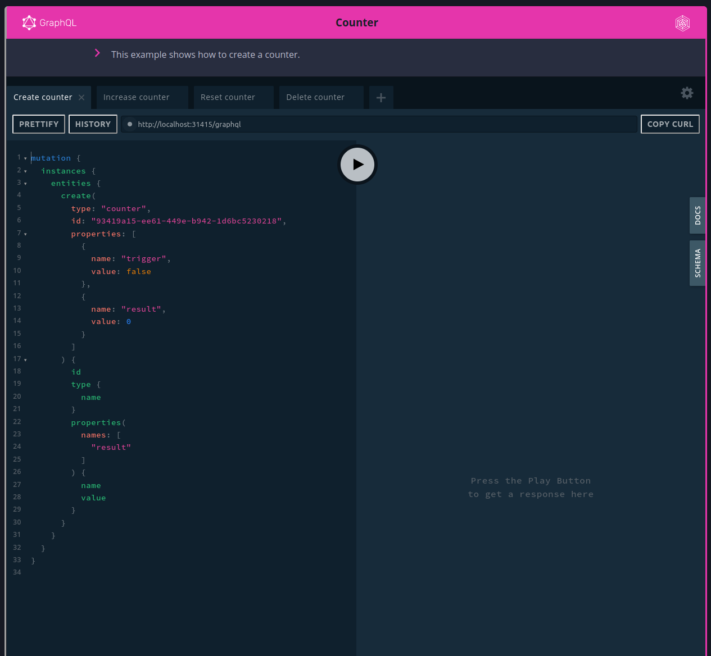

# mdbook-preprocessor-graphql-playground

> A preprocessor for mdbook to add GraphQL playgrounds.

[](assets/images/screenshot.png)

## Usage

1. Add to `book.toml`:
    ```toml
    [preprocessor.graphql-playground]
    command = "mdbook-graphql-playground"
    renderer = ["html"]
    
    [output]
    
    [output.html]
    additional-js = ["graphql-playground-react-middleware.js", "graphql-playground.js"]
    additional-css = ["graphql-playground.css"]
    ```
2. Copy assets into the book root directory:
    ```shell
   cp assets/graphql-playground.css <book_dir>
   cp assets/graphql-playground.js <book_dir>
   cp assets/graphql-playground-react-middleware.js <book_dir>
    ```
