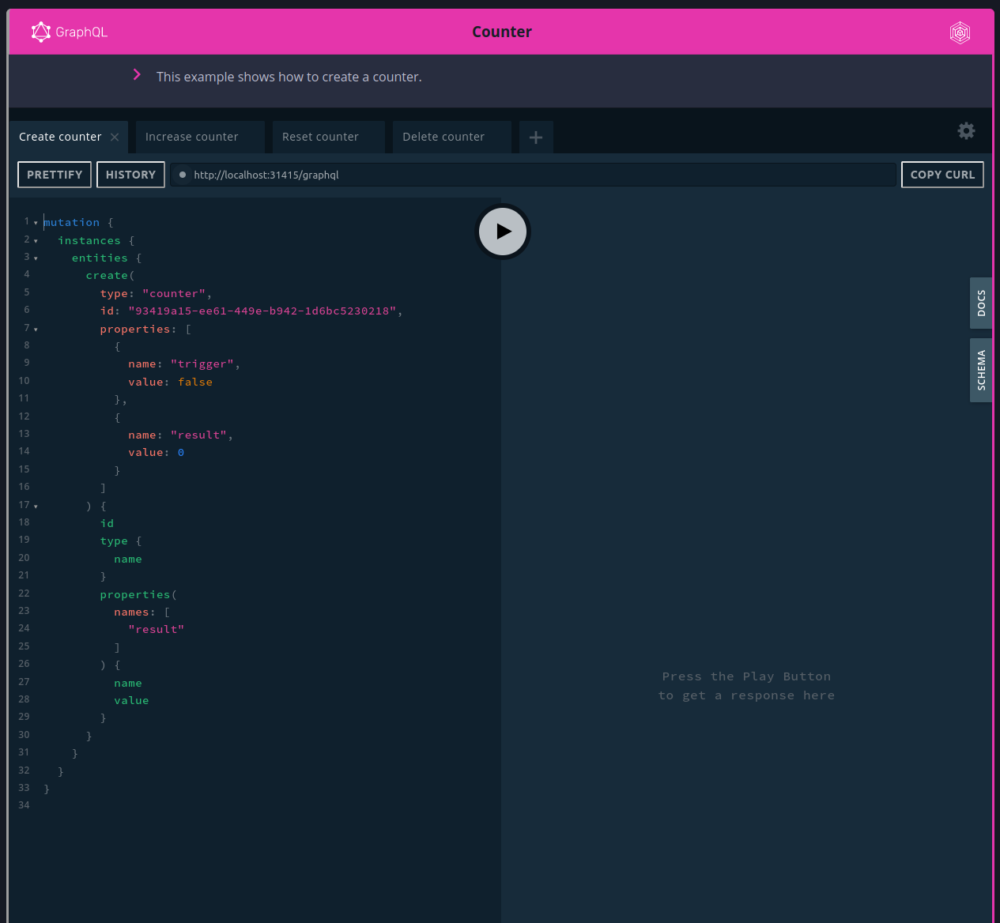

# mdbook-preprocessor-graphql-playground

[](https://aschaeffer.github.io/mdbook-preprocessor-graphql-playground/)
[](https://crates.io/crates/mdbook-preprocessor-graphql-playground)
[](https://www.rust-lang.org/)
[](https://github.com/aschaeffer/mdbook-preprocessor-graphql-playground/actions?query=workflow%3ARust)
[]()
[]()
[](https://crates.io/crates/mdbook-preprocessor-graphql-playground)

> A preprocessor for mdbook to add GraphQL playgrounds.

[](book/src/images/screenshot.png)

## Demo

https://aschaeffer.github.io/mdbook-preprocessor-graphql-playground/

## Usage

1. Install `mdbook-preprocessor-graphql-playground`
    ```shell
    cargo install mdbook-preprocessor-graphql-playground
    ```
2. Add to `book.toml`:
    ```toml
    [preprocessor.graphql-playground]
    command = "mdbook-graphql-playground"
    renderer = ["html"]
    
    [output]
    
    [output.html]
    additional-js = ["graphql-playground-react-middleware.js", "graphql-playground.js"]
    additional-css = ["graphql-playground.css"]
    ```
3. Copy assets into the book root directory:
    ```shell
    cp assets/graphql-playground.css <book_dir>
    cp assets/graphql-playground.js <book_dir>
    cp assets/graphql-playground-react-middleware.js <book_dir>
    cp assets/images/* <book_dir>/src/images/
    ```
4. Create a [query file](#query-files)
    ```shell
    mkdir -p <book_dir>/queries/swapi
    nano <book_dir>/queries/swapi/all-planets.query.graphql
    ```
5. Create a [config file](#config-files)
    ```shell
    mkdir <book_dir>/configs
    nano <book_dir>/configs/swapi.json
    ```
6. Embed the GraphQL Playground in your markdown files
    ```
    {{ graphql_playground(config="/configs/swapi.json") }}
    ```

### Query files

* You can have multiple queries

```graphql
query AllPlanetsQuery {
  allPlanets {
    planets {
      name
      diameter
    }
  }
}
```

### Config files

* You can have multiple config files
* You can have multiple tabs, each refers to a query

```json
{
  "title": "The Star Wars API",
  "description": "Explore the star wars API using mdbook-preprocessor-graphql-playground",
  "endpoint": "https://swapi-graphql.netlify.app/.netlify/functions/index",
  "tabs": [
    {
      "name": "All Planets",
      "url": "/queries/swapi/all-planets.query.graphql"
    }
  ]
}
```

### Use a config in the book

1. Embed with the `graphql_playground` function
2. Specify the location of the config file with the `config` parameter

```
{{ graphql_playground(config="/configs/swapi.json") }}
```

### Example

A full example can be found [in this repository](https://github.com/aschaeffer/mdbook-preprocessor-graphql-playground/tree/main/book)
